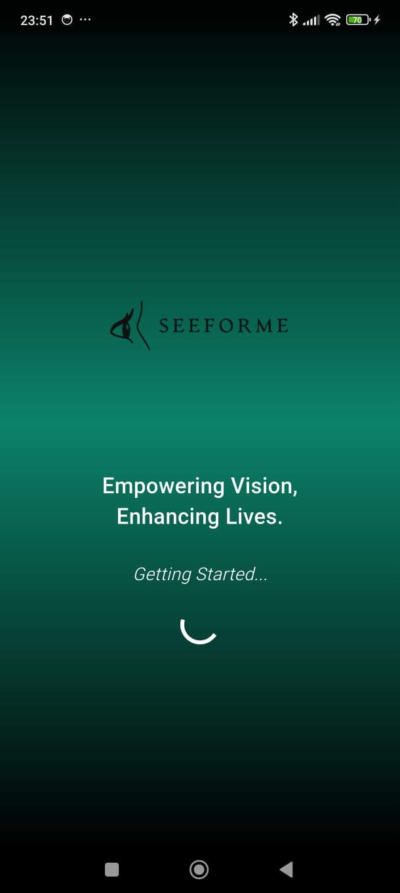

# SeeForMe 👁️‍🗨️

**SeeForMe** is an AI-powered assistive mobile app built for visually impaired individuals to navigate the world around them with confidence and independence.

---

## 📱 Features

- 🔴 **Real-time Color Detection** — Detects object colors via camera and speaks them aloud.
- 📖 **Reading Assistance** — Reads printed text in real-time using text-to-speech.
- 💰 **Indian Currency Recognition** — Identifies INR notes and announces the total.
- 👤 **Face Recognition** — Recognizes known faces and speaks their name & emotion.
- 🧠 **AI-Powered Virtual Assistant** — Describes surroundings using object detection.
- 🖐️ **Gesture Recognition** — Enables AI-based hand gesture communication.
- 📞 **Live Video Assistance** — Video call with sighted helpers for guidance.
- 🧩 **Explore Mode** — Understand nearby objects and obstacles via voice feedback.

---

## 🖼️ Screenshots

| Home Screen | Color Detection | Currency Detection | 
|-------------|------------------|---------------------|
|  |  |  |

> *(You can replace the image paths with actual links or upload images inside an `images/` folder)*

---

## ⚙️ Tech Stack

- 📱 React Native + Expo
- 🧠 Python + Flask (backend for model serving)
- 🎨 TensorFlow / Mediapipe / OpenCV
- 🗂️ MongoDB (for face & user data)
- 🗣️ Text-to-Speech APIs
- 🔍 Image Processing & CV Models

---

## 🚀 Getting Started

### Frontend Setup

```bash
cd SeeForMe
npm install
npx expo start
```

### Backend Setup

```bash
cd backend
python -m venv venv
source venv/bin/activate  # On Windows: venv\Scripts\activate
pip install -r requirements.txt
python app.py
```


